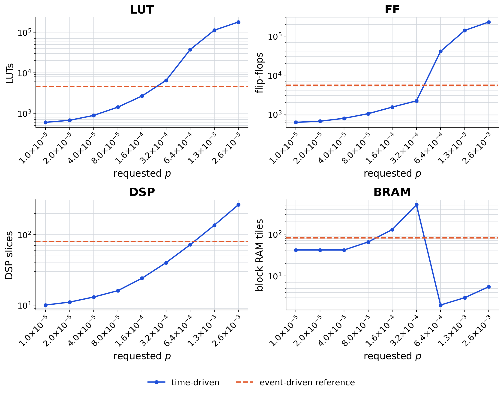
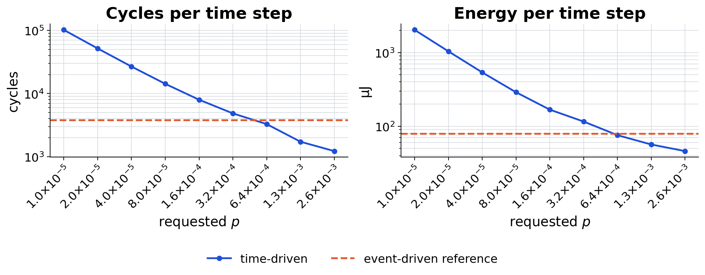

# Percent-parallel reuse report

This report applies only to the current time-driven percent-parallel reuse contract. Legacy directories containing `reduction` and event-driven variants named by `p` are historical artefacts and are not included.

| Component | requested p | latest run | completed stages | HLS status |
|---|---:|---|---|---|
| hls_time_driven_percent_w0001 | 9.9649235e-06 | 20260823T055954Z-05bc2c25d346 | cosim, cosim-setup, csim, export, hls-synth, post-synth-sim, power, prepare, vitis-project, vivado-synth | latency=102064 cycles |
| hls_time_driven_percent_w0002 | 1.9929847e-05 | 20260823T060319Z-498b858ac641 | cosim, cosim-setup, csim, export, hls-synth, post-synth-sim, power, prepare, vitis-project, vivado-synth | latency=51889 cycles |
| hls_time_driven_percent_w0004 | 3.9859694e-05 | 20260823T060648Z-f3a1ef7ebeaa | cosim, cosim-setup, csim, export, hls-synth, post-synth-sim, power, prepare, vitis-project, vivado-synth | latency=26801 cycles |
| hls_time_driven_percent_w0008 | 7.9719388e-05 | 20260823T061016Z-9288d22b76c9 | cosim, cosim-setup, csim, export, hls-synth, post-synth-sim, power, prepare, vitis-project, vivado-synth | latency=14258 cycles |
| hls_time_driven_percent_w0016 | 0.00015943878 | 20260823T061345Z-89b4a87c198a | cosim, cosim-setup, csim, export, hls-synth, post-synth-sim, power, prepare, vitis-project, vivado-synth | latency=7985 cycles |
| hls_time_driven_percent_w0032 | 0.00031887755 | 20260823T061732Z-e83772c12981 | cosim, cosim-setup, csim, export, hls-synth, post-synth-sim, power, prepare, vitis-project, vivado-synth | latency=4848 cycles |
| hls_time_driven_percent_w0064 | 0.0006377551 | 20260823T062225Z-13c340f9c590 | cosim, cosim-setup, csim, export, hls-synth, post-synth-sim, power, prepare, vitis-project, vivado-synth | latency=3280 cycles |
| hls_time_driven_percent_w0128 | 0.0012755102 | 20260823T090106Z-89110dd1c1ee | cosim, cosim-setup, csim, export, hls-synth, post-synth-sim, power, prepare, vitis-project, vivado-synth | latency=1724 cycles |
| hls_time_driven_percent_w0256 | 0.0025510204 | 20260823T154143Z-1f8350b4b652 | cosim, cosim-setup, csim, export, hls-synth, post-synth-sim, power, prepare, vitis-project, vivado-synth | latency=1224 cycles |
| hls_event_driven_scalar | -- | 20260819T040652Z-fbfe72e3d344 | cosim, cosim-setup, csim, export, hls-synth, post-synth-sim, power, prepare, vitis-project, vivado-synth | one event per stream transfer |

## Resource use

The chart and table prefer post-synthesis Vivado out-of-context utilisation. If that stage is unavailable, a hatched bar and the table source identify an HLS estimate rather than a post-synthesis result.

In the chart below, `TD` marks the time-driven implementations and `ED` the event-driven one, which is the reference they are compared against. A resource with no value for a given implementation is annotated `N/A` on its axis. The chart has one panel per resource that some implementation actually uses; URAM is omitted because every component reports zero, and the table below keeps the column so that the absence is on record.

| Implementation | reporting source | LUT | FF | BRAM | DSP | URAM |
|---|---|---:|---:|---:|---:|---:|
| TD U=1 | Vivado OOC | 596 (0.03%) | 616 (0.02%) | 42 (1.56%) | 10 (0.08%) | 0 (0.00%) |
| TD U=2 | Vivado OOC | 669 (0.04%) | 658 (0.02%) | 42 (1.56%) | 11 (0.09%) | 0 (0.00%) |
| TD U=4 | Vivado OOC | 884 (0.05%) | 781 (0.02%) | 42 (1.56%) | 13 (0.11%) | 0 (0.00%) |
| TD U=8 | Vivado OOC | 1415 (0.08%) | 1028 (0.03%) | 65.5 (2.44%) | 16 (0.13%) | 0 (0.00%) |
| TD U=16 | Vivado OOC | 2662 (0.15%) | 1517 (0.04%) | 130 (4.84%) | 24 (0.20%) | 0 (0.00%) |
| TD U=32 | Vivado OOC | 6485 (0.38%) | 2197 (0.06%) | 514 (19.12%) | 40 (0.33%) | 0 (0.00%) |
| TD U=64 | Vivado OOC | 37444 (2.17%) | 40851 (1.18%) | 2 (0.07%) | 72 (0.59%) | 0 (0.00%) |
| TD U=128 | Vivado OOC | 112435 (6.51%) | 140891 (4.08%) | 3 (0.11%) | 136 (1.11%) | 0 (0.00%) |
| TD U=256 | Vivado OOC | 179217 (10.37%) | 232093 (6.72%) | 5.5 (0.20%) | 266 (2.16%) | 0 (0.00%) |
| ED reference | Vivado OOC | 4527 (0.26%) | 5524 (0.16%) | 82 (3.05%) | 80 (0.65%) | 0 (0.00%) |

## Execution time and energy

Both quantities come from a single execution window, and the total energy is the Vivado average power for that window multiplied by its duration. The `window` column names the origin, because an energy figure is only interpretable together with it. Three origins occur, in decreasing order of directness: the SAIF capture measured by the gate-level simulation; the total execution time measured by C/RTL co-simulation; and the HLS latency times the clock period times the time step count, which is available only where synthesis reports a deterministic latency. Values are read from the run's `derived_metrics`, not recomputed here.

Static and dynamic energy are reported separately because only the dynamic share follows the design: device static power is a property of the part and is charged for the whole window regardless of `p`.

The chart at the end of this section shows the same two quantities. `TD` marks the time-driven implementations and `ED` the event-driven one; a `*` marks a provisional value, under the same rule as the table below. The energy bar is split into its static and dynamic parts, the dynamic segment coloured by backend, and either axis switches to a logarithmic scale when the implementations span more than a factor of fifty, which would otherwise leave the fastest bar invisible.

| Implementation | window | total time | time / sample | time / step | total power (dynamic) | total energy (dynamic) | energy / sample | energy / step |
|---|---|---:|---:|---:|---:|---:|---:|---:|
| TD U=1 * | HLS latency | 217.7 ms | 21.77 ms | 680.4 us | 2.98 W (0.035 W) | 648.9 mJ (7.621 mJ) | 64.89 mJ | 2.028 mJ |
| TD U=2 * | HLS latency | 110.7 ms | 11.07 ms | 345.9 us | 3.002 W (0.057 W) | 332.3 mJ (6.31 mJ) | 33.23 mJ | 1.038 mJ |
| TD U=4 * | HLS latency | 57.18 ms | 5.718 ms | 178.7 us | 3.009 W (0.064 W) | 172 mJ (3.659 mJ) | 17.2 mJ | 537.6 uJ |
| TD U=8 * | HLS latency | 30.42 ms | 3.042 ms | 95.05 us | 3.043 W (0.097 W) | 92.56 mJ (2.95 mJ) | 9.256 mJ | 289.2 uJ |
| TD U=16 * | HLS latency | 17.03 ms | 1.703 ms | 53.23 us | 3.155 W (0.207 W) | 53.74 mJ (3.526 mJ) | 5.374 mJ | 168 uJ |
| TD U=32 * | HLS latency | 10.34 ms | 1.034 ms | 32.32 us | 3.583 W (0.627 W) | 37.06 mJ (6.485 mJ) | 3.706 mJ | 115.8 uJ |
| TD U=64 * | HLS latency | 6.997 ms | 699.7 us | 21.87 us | 3.465 W (0.512 W) | 24.25 mJ (3.583 mJ) | 2.425 mJ | 75.77 uJ |
| TD U=128 * | HLS latency | 3.678 ms | 367.8 us | 11.49 us | 4.922 W (1.941 W) | 18.1 mJ (7.139 mJ) | 1.81 mJ | 56.57 uJ |
| TD U=256 * | HLS latency | 2.611 ms | 261.1 us | 8.16 us | 5.641 W (2.647 W) | 14.73 mJ (6.912 mJ) | 1.473 mJ | 46.03 uJ |
| ED reference * | RTL co-sim | 8.083 ms | 808.3 us | 25.26 us | 3.115 W (0.167 W) | 25.18 mJ (1.35 mJ) | 2.518 mJ | 78.68 uJ |

`*` marks a run the pipeline flagged as `power_metrics_provisional`. That happens either because power was estimated vectorless, from default toggle rates rather than the workload's own activity, or because a SAIF capture was partial. The run's `activity_source` distinguishes the two.

### Cycles per time step

This is the quantity the parallelism contract is meant to reduce, so it is compared directly against the event-driven implementation of the same network. The source column matters: a co-simulated figure is measured on the RTL and absorbs back-pressure stalls, whereas a synthesis figure is exact only where the reported latency is deterministic.

| Implementation | source | cycles / time step | vs. event-driven |
|---|---|---:|---|
| TD U=256 | HLS synthesis | 1,224 | **3.10x faster** |
| TD U=128 | HLS synthesis | 1,724 | **2.20x faster** |
| TD U=64 | HLS synthesis | 3,280 | **1.16x faster** |
| ED reference | RTL co-sim | 3,789 | -- |
| TD U=32 | HLS synthesis | 4,848 | 1.28x slower |
| TD U=16 | HLS synthesis | 7,985 | 2.11x slower |
| TD U=8 | HLS synthesis | 14,258 | 3.76x slower |
| TD U=4 | HLS synthesis | 26,801 | 7.07x slower |
| TD U=2 | HLS synthesis | 51,889 | 13.69x slower |
| TD U=1 | HLS synthesis | 102,064 | 26.94x slower |

### Measured RTL latency

These come from C/RTL co-simulation, which is the only source for a design whose synthesis reports `undef`: the per-transaction latency varies with the workload, and in a dataflow region it also absorbs the stalls caused by back-pressure between actors. A trip-count model built from C simulation captures the first effect but not the second.

| Implementation | min | avg | max | spread | interval (avg) |
|---|---:|---:|---:|---:|---:|
| ED reference | 144 | 3,787 | 9,371 | 65x | 3,800 |

Cycles at the configured clock.

## Resolved time-driven plans

### `hls_time_driven_percent_w0001`
- `linear_0` (Linear, mac): W=100352, U=1, R=100352, p_eff=0.000996492%, idle=0
- `lif_0` (LIF, neuron_update): W=128, U=1, R=128, p_eff=0.78125%, idle=0
- `linear_1` (Linear, mac): W=1280, U=1, R=1280, p_eff=0.078125%, idle=0
- `lif_1` (LIF, neuron_update): W=10, U=1, R=10, p_eff=10%, idle=0

### `hls_time_driven_percent_w0002`
- `linear_0` (Linear, mac): W=100352, U=2, R=50176, p_eff=0.00199298%, idle=0
- `lif_0` (LIF, neuron_update): W=128, U=1, R=128, p_eff=0.78125%, idle=0
- `linear_1` (Linear, mac): W=1280, U=1, R=1280, p_eff=0.078125%, idle=0
- `lif_1` (LIF, neuron_update): W=10, U=1, R=10, p_eff=10%, idle=0

### `hls_time_driven_percent_w0004`
- `linear_0` (Linear, mac): W=100352, U=4, R=25088, p_eff=0.00398597%, idle=0
- `lif_0` (LIF, neuron_update): W=128, U=1, R=128, p_eff=0.78125%, idle=0
- `linear_1` (Linear, mac): W=1280, U=1, R=1280, p_eff=0.078125%, idle=0
- `lif_1` (LIF, neuron_update): W=10, U=1, R=10, p_eff=10%, idle=0

### `hls_time_driven_percent_w0008`
- `linear_0` (Linear, mac): W=100352, U=8, R=12544, p_eff=0.00797194%, idle=0
- `lif_0` (LIF, neuron_update): W=128, U=1, R=128, p_eff=0.78125%, idle=0
- `linear_1` (Linear, mac): W=1280, U=1, R=1280, p_eff=0.078125%, idle=0
- `lif_1` (LIF, neuron_update): W=10, U=1, R=10, p_eff=10%, idle=0

### `hls_time_driven_percent_w0016`
- `linear_0` (Linear, mac): W=100352, U=16, R=6272, p_eff=0.0159439%, idle=0
- `lif_0` (LIF, neuron_update): W=128, U=1, R=128, p_eff=0.78125%, idle=0
- `linear_1` (Linear, mac): W=1280, U=1, R=1280, p_eff=0.078125%, idle=0
- `lif_1` (LIF, neuron_update): W=10, U=1, R=10, p_eff=10%, idle=0

### `hls_time_driven_percent_w0032`
- `linear_0` (Linear, mac): W=100352, U=32, R=3136, p_eff=0.0318878%, idle=0
- `lif_0` (LIF, neuron_update): W=128, U=1, R=128, p_eff=0.78125%, idle=0
- `linear_1` (Linear, mac): W=1280, U=1, R=1280, p_eff=0.078125%, idle=0
- `lif_1` (LIF, neuron_update): W=10, U=1, R=10, p_eff=10%, idle=0

### `hls_time_driven_percent_w0064`
- `linear_0` (Linear, mac): W=100352, U=64, R=1568, p_eff=0.0637755%, idle=0
- `lif_0` (LIF, neuron_update): W=128, U=1, R=128, p_eff=0.78125%, idle=0
- `linear_1` (Linear, mac): W=1280, U=1, R=1280, p_eff=0.078125%, idle=0
- `lif_1` (LIF, neuron_update): W=10, U=1, R=10, p_eff=10%, idle=0

### `hls_time_driven_percent_w0128`
- `linear_0` (Linear, mac): W=100352, U=128, R=784, p_eff=0.127551%, idle=0
- `lif_0` (LIF, neuron_update): W=128, U=1, R=128, p_eff=0.78125%, idle=0
- `linear_1` (Linear, mac): W=1280, U=2, R=640, p_eff=0.15625%, idle=0
- `lif_1` (LIF, neuron_update): W=10, U=1, R=10, p_eff=10%, idle=0

### `hls_time_driven_percent_w0256`
- `linear_0` (Linear, mac): W=100352, U=256, R=392, p_eff=0.255102%, idle=0
- `lif_0` (LIF, neuron_update): W=128, U=1, R=128, p_eff=0.78125%, idle=0
- `linear_1` (Linear, mac): W=1280, U=3, R=427, p_eff=0.234375%, idle=1
- `lif_1` (LIF, neuron_update): W=10, U=1, R=10, p_eff=10%, idle=0

## Interpretation

`p` is only the requested percentage. Compare runs using the resolved `W`, `U`, `R`, and `p_eff` values above, then use the HLS/co-simulation reports for achieved II and latency. Resource, timing, and power data must not be inferred from `R` alone.
