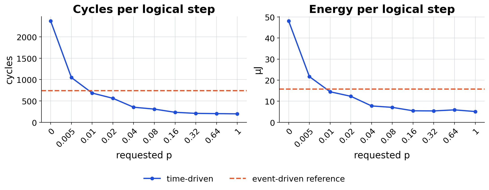
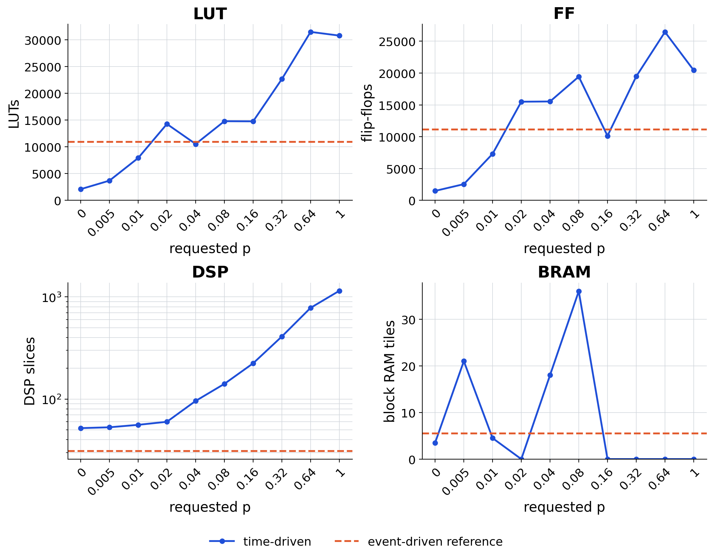
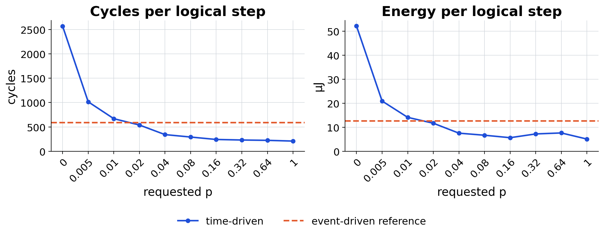
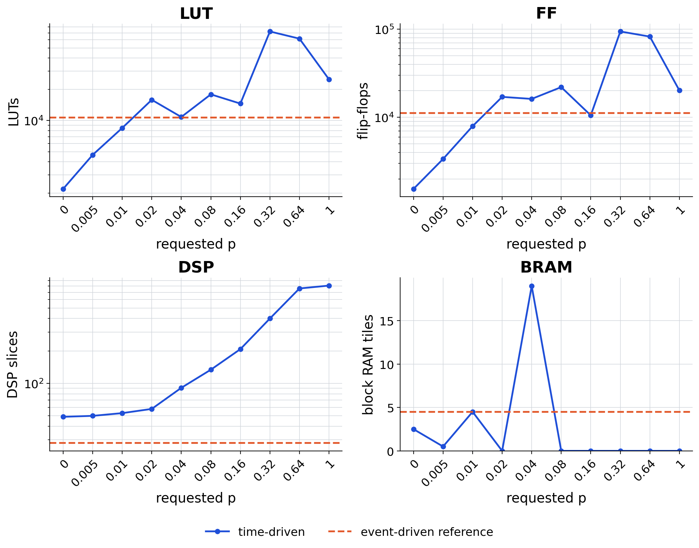

# Braille SRNN percent-parallel sweep

Seven medoid sequences, 256 steps each: 1,792 logical steps per design. Power is a vectorless estimate under default switching activity; every energy figure is therefore an estimate, not an activity-annotated measurement.

`p` is the model-wide request. Each layer resolves its own `U` from its own work domain `W`, so the `U` column is a vector: `[fc1, merge, lif1, w_rec, fc2, lif2]`.

## Braille zero (zero reset, bias)

| implementation | U per layer | source | cycles/step | vs. ED | LUT | FF | DSP | BRAM | power (dyn) | energy/step |
|---|---|---|---:|---|---:|---:|---:|---:|---:|---:|
| TD p=0 | [1, 1, 1, 1, 1, 1] | HLS synthesis | 2,370 | 3.20x slower | 2,092 | 1,484 | 52 | 3.5 | 3.042 W (0.096 W) | 48.06 µJ |
| TD p=0.005 | [2, 1, 1, 7, 1, 1] | HLS synthesis | 1,048 | 1.42x slower | 3,685 | 2,544 | 53 | 21.0 | 3.104 W (0.157 W) | 21.69 µJ |
| TD p=0.01 | [5, 1, 1, 14, 3, 1] | HLS synthesis | 685 | **1.08x faster** | 7,917 | 7,305 | 56 | 4.5 | 3.172 W (0.224 W) | 14.49 µJ |
| TD p=0.02 | [9, 1, 1, 29, 5, 1] | HLS synthesis | 562 | **1.32x faster** | 14,273 | 15,498 | 60 | 0.0 | 3.291 W (0.341 W) | 12.33 µJ |
| TD p=0.04 | [18, 2, 2, 58, 11, 1] | HLS synthesis | 353 | **2.10x faster** | 10,529 | 15,534 | 96 | 18.0 | 3.297 W (0.346 W) | 7.76 µJ |
| TD p=0.08 | [36, 3, 3, 116, 21, 1] | HLS synthesis | 309 | **2.40x faster** | 14,791 | 19,436 | 141 | 36.0 | 3.438 W (0.485 W) | 7.08 µJ |
| TD p=0.16 | [73, 6, 6, 231, 43, 1] | HLS synthesis | 234 | **3.16x faster** | 14,767 | 10,134 | 224 | 0.0 | 3.499 W (0.545 W) | 5.46 µJ |
| TD p=0.32 | [146, 12, 12, 462, 85, 2] | HLS synthesis | 209 | **3.54x faster** | 22,665 | 19,469 | 410 | 0.0 | 3.874 W (0.913 W) | 5.40 µJ |
| TD p=0.64 | [292, 24, 24, 924, 170, 4] | HLS synthesis | 203 | **3.65x faster** | 31,483 | 26,452 | 782 | 0.0 | 4.353 W (1.383 W) | 5.89 µJ |
| TD p=1 | [456, 38, 38, 1444, 266, 7] | HLS synthesis | 198 | **3.74x faster** | 30,793 | 20,437 | 1,148 | 0.0 | 3.869 W (0.907 W) | 5.11 µJ |
| ED active-list | -- | RTL co-sim | 740 | -- | 10,906 | 11,118 | 31 | 5.5 | 3.189 W (0.241 W) | 15.74 µJ |

## Braille subtract (subtractive reset, no bias)

| implementation | U per layer | source | cycles/step | vs. ED | LUT | FF | DSP | BRAM | power (dyn) | energy/step |
|---|---|---|---:|---|---:|---:|---:|---:|---:|---:|
| TD p=0 | [1, 1, 1, 1, 1, 1] | HLS synthesis | 2,571 | 4.37x slower | 2,194 | 1,546 | 49 | 2.5 | 3.042 W (0.096 W) | 52.14 µJ |
| TD p=0.005 | [2, 1, 1, 8, 1, 1] | HLS synthesis | 1,016 | 1.73x slower | 4,669 | 3,375 | 50 | 0.5 | 3.086 W (0.139 W) | 20.90 µJ |
| TD p=0.01 | [5, 1, 1, 16, 3, 1] | HLS synthesis | 669 | 1.14x slower | 8,486 | 7,947 | 53 | 4.5 | 3.163 W (0.215 W) | 14.11 µJ |
| TD p=0.02 | [10, 1, 1, 32, 6, 1] | HLS synthesis | 539 | **1.09x faster** | 15,846 | 17,061 | 58 | 0.0 | 3.247 W (0.297 W) | 11.67 µJ |
| TD p=0.04 | [19, 2, 2, 64, 11, 1] | HLS synthesis | 342 | **1.72x faster** | 10,826 | 16,180 | 91 | 19.0 | 3.303 W (0.352 W) | 7.53 µJ |
| TD p=0.08 | [38, 3, 3, 128, 22, 1] | HLS synthesis | 292 | **2.01x faster** | 17,891 | 22,000 | 134 | 0.0 | 3.426 W (0.473 W) | 6.67 µJ |
| TD p=0.16 | [77, 6, 6, 256, 45, 1] | HLS synthesis | 242 | **2.43x faster** | 14,576 | 10,544 | 208 | 0.0 | 3.498 W (0.543 W) | 5.64 µJ |
| TD p=0.32 | [154, 13, 13, 512, 90, 2] | HLS synthesis | 231 | **2.55x faster** | 72,247 | 94,024 | 400 | 0.0 | 4.684 W (1.707 W) | 7.21 µJ |
| TD p=0.64 | [307, 26, 26, 1024, 179, 4] | HLS synthesis | 224 | **2.63x faster** | 61,613 | 82,279 | 760 | 0.0 | 5.103 W (2.119 W) | 7.62 µJ |
| TD p=1 | [480, 40, 40, 1600, 280, 7] | HLS synthesis | 209 | **2.81x faster** | 24,965 | 20,189 | 808 | 0.0 | 3.641 W (0.684 W) | 5.07 µJ |
| ED active-list | -- | RTL co-sim | 588 | -- | 10,727 | 11,197 | 28 | 4.5 | 3.205 W (0.256 W) | 12.57 µJ |

